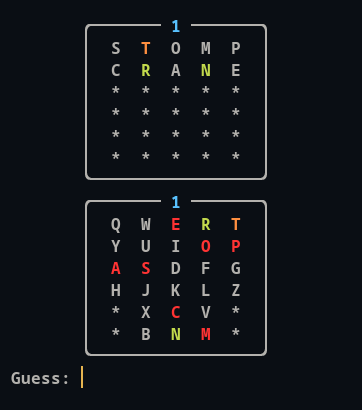
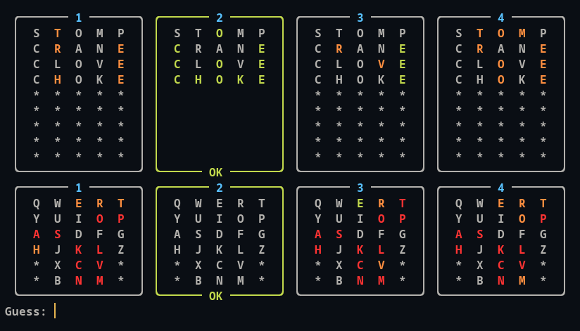

# Wordle
Play Wordle directly from your terminal.

This project was based on [Termo](https://term.ooo), a Brazilian Portuguese version of the original [Wordle](https://www.nytimes.com/games/wordle/index.html). 

**Features**
- No limits! Play as much as you want.
- Different languages.
  - The `en_us` version contains the same words from the original Wordle.
- Different modes for more fun!
- A visual keyboard.

## Modes
- **Solo Mode** by setting the `--mode` option to "solo".

    

- **Duo Mode** by setting the `--mode` option to "duo".

    

- **Quad Mode** by setting the `--mode` option to "quad".

    

    Solved puzzles do not accept more inputs and are extremely easy to identify. For example:

    

## Locales
You can change locales by passing a locale to the `-l` option, e.g. `wordle -l pt_br` for Brazilian Portuguese words.

Available locales:
- en_us - American English (Default)
- pt_br - Brazilian Portuguese

## Debug
`Wordle` comes with a debug mode, which shows the secret word on the top of each puzzle. To enable debug mode, pass the `-d` flag to `wordle`, e.g., `wordle -d`.

## Install
1. Download and install [Poetry](https://python-poetry.org/) in your machine.
2. Clone this repository: `git clone https://github.com/lucasshiva/wordle`
3. Move into the cloned folder: `cd wordle`
4. Install this project with Poetry: `poetry install`
5. Activate the virtual environment: `poetry shell`.
6. Run `wordle` on your terminal. Optionally, run `wordle --help` first for a full list of options.

**Note:** The `wordle` command only exists inside the virtual environment. You need to run `poetry shell` everytime you wish to use it.

